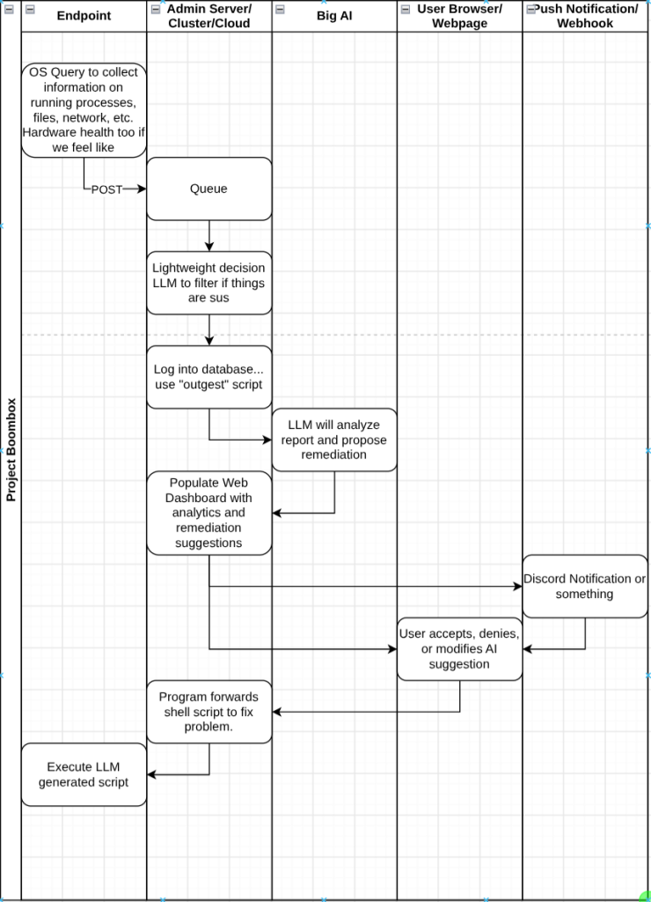

## Project overview

## Things to do
### Linux Client - Kade
- [ ] Figure out how OSQuery works
- [ ] Figure out how to use a service user to send data, listen, and execute arbitrary commands
- [ ] Create API format for dashboard to call with remediation commands (with Mateo)

### Windows Client - Mateo
- [ ] Same as above but for Windows :D

### AI Models - Andrew
- [ ] Create API format for clients to call to send data to (HTTP POST)
- [ ] Actually set up all the model stuff - decision model + remediation model (OpenAI keys?)

### Database - Aiden
- [ ] Work with andrew to figure out API for model to call to load remediations
- [ ] Configure an actual PostgreSQL database
- [ ] Work with Xander to figure out how to push updates to browser when new remediations are ready for review

### Dashboard - Xander
- [ ] Create a browser based UI
  - [ ] Display new remediations for review as they come in (Work with Aiden)
  - [ ] Allow admin to approve or deny suggested remediations
  - [ ] Send approved remediations to clients (Work with Kade and Mateo)
- [ ] Configure a web server to communicate with database and serve website (Nginx?Go?Flask? Whatever you want)

### Infrastructure - Ethan
- [ ] Decide whether to self host or use CSRL infra
- [ ] Provision VMS - Linux client, Windows client, Linux server (Work with team members on preferred Distros)
- [ ] Get team members access to infrastructure (Tailscale, other VPN, or publicly exposed if you're feeling risky)